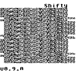
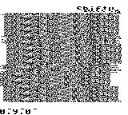
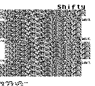

# Shifty (Game Boy ROM)

An experiment inspired by [Shitwave - A PRNG based drone generator for Gameboy](https://blog.gg8.se/wordpress/2009/03/23/shitwave-a-prng-based-drone-generator-for-gameboy/).

## Controls

- `Start` - Play / Stop
- `Select` - Reset waveform (only during playback)
- `Up` / `Down` - Increase / Decrease period value
- `A` + `Up` / `Down` - Increase / Decrease period value by 10

## Build from source (Linux)

1. Clone the repository.
2. Build the ROM from source code using the `make` command.

## Screenshots

## Special Thanks

- [GBDK-2020](https://github.com/gbdk-2020/gbdk-2020)
- [Pan Docs](https://gbdev.io/pandocs/)
- [Gameboy Development Forum](https://gbdev.gg8.se/forums/index.php)
